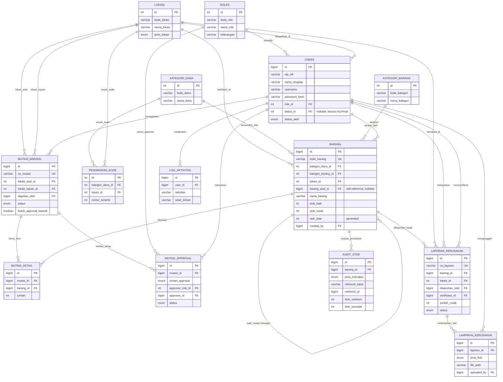

# Arsitektur Database — Aplikasi Inventaris Sekolah
**DBMS Target: MySQL 8.0+**

> **Catatan penyelarasan spesifikasi:** Pada poin instruksi awal disebutkan target DBMS adalah *MySQL*, namun pada bagian format output (poin 4.D) tertulis "sintaks PostgreSQL". Karena instruksi utama (poin 0) secara eksplisit menetapkan MySQL sebagai basis, seluruh DDL, trigger, dan tipe data pada dokumen ini konsisten menggunakan **dialek MySQL 8.0+** (memanfaatkan fitur `GENERATED COLUMN`, `CHECK CONSTRAINT`, dan `SIGNAL` yang tersedia di versi ini).

---

## A. Diagram ERD Visual (Mermaid.js)



---

## B. Data Flow & State Narrative

### 1. Hak Akses (Roles)
`tbl_roles` menyimpan 4 peran baku. Setiap `tbl_users` terhubung ke satu `role_id`. Ka.Prodi juga memiliki `lokasi_id` (unit kerja/prodi tempatnya bertanggung jawab), sedangkan Kepsek/Sarpras/Ka.TU bersifat lintas-lokasi (`lokasi_id` NULL). Pemisahan role ke tabel sendiri (bukan ENUM langsung di `users`) memudahkan penambahan peran baru tanpa mengubah struktur tabel `users`.

| Peran | Hak Utama |
|---|---|
| Kepsek | Monitoring global, approval akhir mutasi besar & laporan tahunan |
| Sarpras | Verifikasi data, approval serah terima tahap 1, rekap sarpras |
| Ka.TU | CRUD Master Data (User, Lokasi, Kategori Dana, Kategori Barang) |
| Ka.Prodi | Input pengajuan kebutuhan, penanggung jawab barang di prodinya, pelapor kerusakan & mutasi |

### 2. Alur Auto-Generate Kode Barang
Saat Ka.TU/Ka.Prodi menginput barang baru (`INSERT INTO tbl_barang`), trigger `trg_before_insert_barang` berjalan **sebelum** baris tersimpan:
1. Ambil `kode_dana` dari `tbl_kategori_dana` dan `kode_lokasi` dari `tbl_lokasi`.
2. Increment counter atomik pada `tbl_penomoran_kode` (kombinasi kategori-dana + lokasi).
3. Bentuk `kode_barang` = `[KODE_DANA]-[KODE_LOKASI]-[NOMOR 3 digit]`, contoh `BOS-RPL-001`.

Kode ini bersifat **historis/tetap** — merepresentasikan sumber dana & lokasi asal pencatatan pertama kali, sesuai praktik pelabelan aset sekolah (mirip KIB/BAST), dan tidak diubah walau barang berpindah lokasi di kemudian hari.

### 3. Alur Serah Terima / Mutasi Barang (State Machine)
```
Draft → Pending (verifikasi Sarpras) → [jika butuh_approval_kepsek] Pending (approval Kepsek) → Approved
                                    ↘ Rejected (di tahap manapun)
```
- Ka.Prodi membuat `tbl_mutasi_barang` berstatus **Draft** beserta daftar barang di `tbl_mutasi_detail`.
- Saat diajukan → status **Pending**, sistem membuat baris `tbl_mutasi_approval` (urutan 1 = Sarpras).
- Sarpras memverifikasi. Jika mutasi tergolong besar (`butuh_approval_kepsek = TRUE`, ditentukan aplikasi berdasarkan nilai/kuantitas aset), dibuat baris approval urutan 2 (Kepsek) dan status tetap **Pending**.
- Approval final (Sarpras jika tidak butuh Kepsek, atau Kepsek jika butuh) mengubah `tbl_mutasi_barang.status` menjadi **Approved**.
- **Hanya saat status akhir menjadi `Approved`**, trigger `trg_after_update_mutasi_approved` mengeksekusi perpindahan stok (lihat bagian E).
- Penolakan di tahap manapun langsung mengubah status menjadi **Rejected**, tanpa mengubah stok.

### 4. Alur Pelaporan Barang Rusak
- Ka.Prodi membuat `tbl_laporan_kerusakan` (status **Draft**) dan mengunggah minimal 3 foto ke `tbl_lampiran_kerusakan` (`Tampak Depan`, `Tampak Samping`, `Detail Kerusakan`).
- Saat status diajukan menjadi **Pending**, trigger `trg_before_update_laporan_validasi_foto` memvalidasi ketiga jenis foto sudah lengkap — jika belum, transaksi ditolak dengan `SIGNAL`.
- Sarpras memverifikasi → **Approved**/**Rejected**.
- Saat **Approved**, trigger `trg_after_update_laporan_kerusakan_stok` memindahkan kuantitas dari `stok_baik` ke `stok_rusak` pada `tbl_barang` terkait (total stok tidak berubah, hanya rekategorisasi kondisi).

### 5. Audit Trail & Rekapitulasi
Setiap perubahan `stok_baik`/`stok_rusak` pada `tbl_barang` — baik dipicu oleh mutasi maupun laporan kerusakan — otomatis tercatat oleh trigger generik `trg_after_update_barang_stok` ke `tbl_audit_stok`. Trigger sumber (mutasi/kerusakan) menitipkan konteks lewat *session variable* (`@audit_ref_table`, `@audit_ref_id`, `@audit_jenis`) sebelum meng-update `tbl_barang`, sehingga trigger audit generik tidak perlu tahu siapa pemicunya namun tetap mencatat referensi yang benar. Tabel ini menjadi sumber rekap bulanan/tahunan (`GROUP BY MONTH(created_at)`, dsb).

> **Catatan trade-off desain:** `tbl_audit_stok` menggunakan pola *referensi polimorfik* (`referensi_tabel` + `referensi_id`) sehingga tidak bisa diikat `FOREIGN KEY` tunggal ke tabel sumber. Ini pilihan sadar demi fleksibilitas log lintas-tabel; integritas dijaga di level trigger, bukan constraint DB.

---

## C. Perancangan Tabel Database

### `tbl_roles`
| Kolom | Tipe Data | Constraint | Keterangan |
|---|---|---|---|
| id | INT | PK, AUTO_INCREMENT | |
| kode_role | VARCHAR(20) | UNIQUE, NOT NULL | KEPSEK, SARPRAS, KATU, KAPRODI |
| nama_role | VARCHAR(50) | NOT NULL | |
| keterangan | VARCHAR(255) | NULL | |

### `tbl_users`
| Kolom | Tipe Data | Constraint | Keterangan |
|---|---|---|---|
| id | BIGINT | PK, AUTO_INCREMENT | |
| nip_nik | VARCHAR(30) | UNIQUE, NULL | |
| nama_lengkap | VARCHAR(100) | NOT NULL | |
| username | VARCHAR(50) | UNIQUE, NOT NULL | |
| email | VARCHAR(100) | UNIQUE, NULL | |
| password_hash | VARCHAR(255) | NOT NULL | Hash bcrypt/argon2, bukan plaintext |
| role_id | INT | FK → tbl_roles(id), NOT NULL | |
| lokasi_id | INT | FK → tbl_lokasi(id), NULL | Diisi khusus Ka.Prodi |
| status_aktif | ENUM('Aktif','Nonaktif') | DEFAULT 'Aktif' | |
| created_at | TIMESTAMP | DEFAULT CURRENT_TIMESTAMP | |
| updated_at | TIMESTAMP | ON UPDATE CURRENT_TIMESTAMP | |

### `tbl_lokasi`
| Kolom | Tipe Data | Constraint | Keterangan |
|---|---|---|---|
| id | INT | PK, AUTO_INCREMENT | |
| kode_lokasi | VARCHAR(10) | UNIQUE, NOT NULL | Cth: RPL, TKJ, TU, GDG |
| nama_lokasi | VARCHAR(100) | NOT NULL | |
| jenis_lokasi | ENUM('Prodi','Unit Kerja','Gudang') | NOT NULL | |
| keterangan | VARCHAR(255) | NULL | |

### `tbl_kategori_dana`
| Kolom | Tipe Data | Constraint | Keterangan |
|---|---|---|---|
| id | INT | PK, AUTO_INCREMENT | |
| kode_dana | VARCHAR(10) | UNIQUE, NOT NULL | BOS / KMT |
| nama_dana | VARCHAR(50) | NOT NULL | Bantuan Operasional Sekolah / Komite |

### `tbl_kategori_barang`
| Kolom | Tipe Data | Constraint | Keterangan |
|---|---|---|---|
| id | INT | PK, AUTO_INCREMENT | |
| kode_kategori | VARCHAR(10) | UNIQUE, NOT NULL | |
| nama_kategori | VARCHAR(50) | NOT NULL | Cth: Elektronik, Mebeulair, ATK |
| keterangan | VARCHAR(255) | NULL | |

### `tbl_penomoran_kode` (helper penomoran atomik)
| Kolom | Tipe Data | Constraint | Keterangan |
|---|---|---|---|
| id | INT | PK, AUTO_INCREMENT | |
| kategori_dana_id | INT | FK → tbl_kategori_dana(id), NOT NULL | |
| lokasi_id | INT | FK → tbl_lokasi(id), NOT NULL | |
| nomor_terakhir | INT | NOT NULL, DEFAULT 0 | |
| | | UNIQUE(kategori_dana_id, lokasi_id) | |

### `tbl_barang`
| Kolom | Tipe Data | Constraint | Keterangan |
|---|---|---|---|
| id | BIGINT | PK, AUTO_INCREMENT | |
| kode_barang | VARCHAR(30) | UNIQUE, NOT NULL | Auto-generate oleh trigger |
| kategori_dana_id | INT | FK → tbl_kategori_dana(id), NOT NULL | |
| kategori_barang_id | INT | FK → tbl_kategori_barang(id), NOT NULL | |
| lokasi_id | INT | FK → tbl_lokasi(id), NOT NULL | Lokasi saat ini |
| barang_asal_id | BIGINT | FK → tbl_barang(id), NULL | Lineage hasil mutasi |
| nama_barang | VARCHAR(150) | NOT NULL | |
| spesifikasi | TEXT | NULL | |
| satuan | VARCHAR(20) | NOT NULL, DEFAULT 'Unit' | |
| stok_baik | INT | NOT NULL, DEFAULT 0, CHECK ≥ 0 | |
| stok_rusak | INT | NOT NULL, DEFAULT 0, CHECK ≥ 0 | |
| stok_total | INT | GENERATED ALWAYS AS (stok_baik+stok_rusak) STORED | Kolom turunan, konsisten otomatis |
| harga_perolehan | DECIMAL(15,2) | DEFAULT 0 | |
| tanggal_perolehan | DATE | NULL | |
| kondisi_umum | ENUM('Baik','Rusak Ringan','Rusak Berat') | DEFAULT 'Baik' | |
| status_aktif | ENUM('Aktif','Non-Aktif','Dihapus') | DEFAULT 'Aktif' | |
| created_by | BIGINT | FK → tbl_users(id), NOT NULL | |
| created_at / updated_at | TIMESTAMP | DEFAULT/ON UPDATE CURRENT_TIMESTAMP | |

### `tbl_mutasi_barang`
| Kolom | Tipe Data | Constraint | Keterangan |
|---|---|---|---|
| id | BIGINT | PK, AUTO_INCREMENT | |
| no_mutasi | VARCHAR(30) | UNIQUE, NOT NULL | Cth: MUT-2026-0001 |
| lokasi_asal_id | INT | FK → tbl_lokasi(id), NOT NULL | |
| lokasi_tujuan_id | INT | FK → tbl_lokasi(id), NOT NULL, CHECK ≠ lokasi_asal_id | |
| diajukan_oleh | BIGINT | FK → tbl_users(id), NOT NULL | |
| tanggal_pengajuan | DATE | NOT NULL | |
| butuh_approval_kepsek | BOOLEAN | NOT NULL, DEFAULT FALSE | |
| status | ENUM('Draft','Pending','Approved','Rejected') | NOT NULL, DEFAULT 'Draft' | |
| keterangan | TEXT | NULL | |
| created_at / updated_at | TIMESTAMP | DEFAULT/ON UPDATE CURRENT_TIMESTAMP | |

### `tbl_mutasi_detail`
| Kolom | Tipe Data | Constraint | Keterangan |
|---|---|---|---|
| id | BIGINT | PK, AUTO_INCREMENT | |
| mutasi_id | BIGINT | FK → tbl_mutasi_barang(id), NOT NULL | |
| barang_id | BIGINT | FK → tbl_barang(id), NOT NULL | |
| jumlah | INT | NOT NULL, CHECK > 0 | |
| kondisi_saat_mutasi | ENUM('Baik','Rusak Ringan') | DEFAULT 'Baik' | |

### `tbl_mutasi_approval`
| Kolom | Tipe Data | Constraint | Keterangan |
|---|---|---|---|
| id | BIGINT | PK, AUTO_INCREMENT | |
| mutasi_id | BIGINT | FK → tbl_mutasi_barang(id), NOT NULL | |
| urutan_approval | TINYINT | NOT NULL | 1 = Sarpras, 2 = Kepsek |
| approver_role_id | INT | FK → tbl_roles(id), NOT NULL | |
| approver_id | BIGINT | FK → tbl_users(id), NULL | Diisi saat approval dieksekusi |
| status | ENUM('Menunggu','Approved','Rejected') | DEFAULT 'Menunggu' | |
| catatan | TEXT | NULL | |
| tanggal_approval | DATETIME | NULL | |
| | | UNIQUE(mutasi_id, urutan_approval) | |

### `tbl_laporan_kerusakan`
| Kolom | Tipe Data | Constraint | Keterangan |
|---|---|---|---|
| id | BIGINT | PK, AUTO_INCREMENT | |
| no_laporan | VARCHAR(30) | UNIQUE, NOT NULL | |
| barang_id | BIGINT | FK → tbl_barang(id), NOT NULL | |
| lokasi_id | INT | FK → tbl_lokasi(id), NOT NULL | |
| dilaporkan_oleh | BIGINT | FK → tbl_users(id), NOT NULL | |
| tanggal_laporan | DATE | NOT NULL | |
| jumlah_rusak | INT | NOT NULL, CHECK > 0 | |
| deskripsi_kerusakan | TEXT | NOT NULL | |
| status | ENUM('Draft','Pending','Approved','Rejected') | DEFAULT 'Draft' | |
| verifikator_id | BIGINT | FK → tbl_users(id), NULL | |
| tanggal_verifikasi | DATETIME | NULL | |
| catatan_verifikasi | TEXT | NULL | |
| created_at | TIMESTAMP | DEFAULT CURRENT_TIMESTAMP | |

### `tbl_lampiran_kerusakan`
| Kolom | Tipe Data | Constraint | Keterangan |
|---|---|---|---|
| id | BIGINT | PK, AUTO_INCREMENT | |
| laporan_id | BIGINT | FK → tbl_laporan_kerusakan(id), NOT NULL | |
| jenis_foto | ENUM('Tampak Depan','Tampak Samping','Detail Kerusakan') | NOT NULL | |
| file_path | VARCHAR(255) | NOT NULL | |
| uploaded_by | BIGINT | FK → tbl_users(id), NOT NULL | |
| uploaded_at | TIMESTAMP | DEFAULT CURRENT_TIMESTAMP | |

### `tbl_audit_stok`
| Kolom | Tipe Data | Constraint | Keterangan |
|---|---|---|---|
| id | BIGINT | PK, AUTO_INCREMENT | |
| barang_id | BIGINT | FK → tbl_barang(id), NOT NULL | |
| jenis_transaksi | ENUM('Barang Baru','Mutasi Masuk','Mutasi Keluar','Kerusakan','Perbaikan','Penyesuaian Manual') | NOT NULL | |
| referensi_tabel | VARCHAR(50) | NULL | Polimorfik, tanpa FK fisik |
| referensi_id | BIGINT | NULL | |
| stok_sebelum | INT | NOT NULL | |
| stok_sesudah | INT | NOT NULL | |
| jumlah_perubahan | INT | NOT NULL | |
| keterangan | VARCHAR(255) | NULL | |
| created_at | TIMESTAMP | DEFAULT CURRENT_TIMESTAMP | |

### `tbl_log_aktivitas` (bonus — keamanan & jejak sistem)
| Kolom | Tipe Data | Constraint | Keterangan |
|---|---|---|---|
| id | BIGINT | PK, AUTO_INCREMENT | |
| user_id | BIGINT | FK → tbl_users(id), NULL | |
| aktivitas | VARCHAR(255) | NOT NULL | Cth: "Login", "Ubah Master Kategori" |
| tabel_terkait | VARCHAR(50) | NULL | |
| data_terkait_id | BIGINT | NULL | |
| alamat_ip | VARCHAR(45) | NULL | |
| created_at | TIMESTAMP | DEFAULT CURRENT_TIMESTAMP | |

---

## D. Kueri SQL (DDL) Lengkap — MySQL 8.0+

```sql
SET NAMES utf8mb4;
SET FOREIGN_KEY_CHECKS = 0;

-- =========================================================
-- 1. MASTER: ROLES
-- =========================================================
CREATE TABLE tbl_roles (
    id            INT AUTO_INCREMENT PRIMARY KEY,
    kode_role     VARCHAR(20)  NOT NULL,
    nama_role     VARCHAR(50)  NOT NULL,
    keterangan    VARCHAR(255) NULL,
    CONSTRAINT uq_roles_kode UNIQUE (kode_role)
) ENGINE=InnoDB DEFAULT CHARSET=utf8mb4;

-- =========================================================
-- 2. MASTER: LOKASI (Prodi / Unit Kerja / Gudang)
-- =========================================================
CREATE TABLE tbl_lokasi (
    id            INT AUTO_INCREMENT PRIMARY KEY,
    kode_lokasi   VARCHAR(10)  NOT NULL,
    nama_lokasi   VARCHAR(100) NOT NULL,
    jenis_lokasi  ENUM('Prodi','Unit Kerja','Gudang') NOT NULL,
    keterangan    VARCHAR(255) NULL,
    CONSTRAINT uq_lokasi_kode UNIQUE (kode_lokasi)
) ENGINE=InnoDB DEFAULT CHARSET=utf8mb4;

-- =========================================================
-- 3. MASTER: KATEGORI SUMBER DANA
-- =========================================================
CREATE TABLE tbl_kategori_dana (
    id          INT AUTO_INCREMENT PRIMARY KEY,
    kode_dana   VARCHAR(10) NOT NULL,
    nama_dana   VARCHAR(50) NOT NULL,
    CONSTRAINT uq_kategori_dana_kode UNIQUE (kode_dana)
) ENGINE=InnoDB DEFAULT CHARSET=utf8mb4;

-- =========================================================
-- 4. MASTER: KATEGORI BARANG
-- =========================================================
CREATE TABLE tbl_kategori_barang (
    id             INT AUTO_INCREMENT PRIMARY KEY,
    kode_kategori  VARCHAR(10) NOT NULL,
    nama_kategori  VARCHAR(50) NOT NULL,
    keterangan     VARCHAR(255) NULL,
    CONSTRAINT uq_kategori_barang_kode UNIQUE (kode_kategori)
) ENGINE=InnoDB DEFAULT CHARSET=utf8mb4;

-- =========================================================
-- 5. USERS
-- =========================================================
CREATE TABLE tbl_users (
    id             BIGINT AUTO_INCREMENT PRIMARY KEY,
    nip_nik        VARCHAR(30)  NULL,
    nama_lengkap   VARCHAR(100) NOT NULL,
    username       VARCHAR(50)  NOT NULL,
    email          VARCHAR(100) NULL,
    password_hash  VARCHAR(255) NOT NULL,
    role_id        INT NOT NULL,
    lokasi_id      INT NULL,
    status_aktif   ENUM('Aktif','Nonaktif') NOT NULL DEFAULT 'Aktif',
    created_at     TIMESTAMP NOT NULL DEFAULT CURRENT_TIMESTAMP,
    updated_at     TIMESTAMP NOT NULL DEFAULT CURRENT_TIMESTAMP ON UPDATE CURRENT_TIMESTAMP,
    CONSTRAINT uq_users_username UNIQUE (username),
    CONSTRAINT uq_users_email UNIQUE (email),
    CONSTRAINT uq_users_nik UNIQUE (nip_nik),
    CONSTRAINT fk_users_role FOREIGN KEY (role_id) REFERENCES tbl_roles(id),
    CONSTRAINT fk_users_lokasi FOREIGN KEY (lokasi_id) REFERENCES tbl_lokasi(id)
) ENGINE=InnoDB DEFAULT CHARSET=utf8mb4;

CREATE INDEX idx_users_role ON tbl_users(role_id);
CREATE INDEX idx_users_lokasi ON tbl_users(lokasi_id);

-- =========================================================
-- 6. HELPER: PENOMORAN KODE (counter atomik per kategori+lokasi)
-- =========================================================
CREATE TABLE tbl_penomoran_kode (
    id                INT AUTO_INCREMENT PRIMARY KEY,
    kategori_dana_id  INT NOT NULL,
    lokasi_id         INT NOT NULL,
    nomor_terakhir    INT NOT NULL DEFAULT 0,
    CONSTRAINT uq_penomoran UNIQUE (kategori_dana_id, lokasi_id),
    CONSTRAINT fk_penomoran_dana FOREIGN KEY (kategori_dana_id) REFERENCES tbl_kategori_dana(id),
    CONSTRAINT fk_penomoran_lokasi FOREIGN KEY (lokasi_id) REFERENCES tbl_lokasi(id)
) ENGINE=InnoDB DEFAULT CHARSET=utf8mb4;

-- =========================================================
-- 7. BARANG (Item & Stok)
-- =========================================================
CREATE TABLE tbl_barang (
    id                   BIGINT AUTO_INCREMENT PRIMARY KEY,
    kode_barang          VARCHAR(30) NOT NULL,
    kategori_dana_id     INT NOT NULL,
    kategori_barang_id   INT NOT NULL,
    lokasi_id            INT NOT NULL,
    barang_asal_id       BIGINT NULL,
    nama_barang          VARCHAR(150) NOT NULL,
    spesifikasi          TEXT NULL,
    satuan               VARCHAR(20) NOT NULL DEFAULT 'Unit',
    stok_baik            INT NOT NULL DEFAULT 0,
    stok_rusak           INT NOT NULL DEFAULT 0,
    stok_total           INT GENERATED ALWAYS AS (stok_baik + stok_rusak) STORED,
    harga_perolehan      DECIMAL(15,2) NOT NULL DEFAULT 0,
    tanggal_perolehan    DATE NULL,
    kondisi_umum         ENUM('Baik','Rusak Ringan','Rusak Berat') NOT NULL DEFAULT 'Baik',
    status_aktif         ENUM('Aktif','Non-Aktif','Dihapus') NOT NULL DEFAULT 'Aktif',
    created_by           BIGINT NOT NULL,
    created_at           TIMESTAMP NOT NULL DEFAULT CURRENT_TIMESTAMP,
    updated_at           TIMESTAMP NOT NULL DEFAULT CURRENT_TIMESTAMP ON UPDATE CURRENT_TIMESTAMP,
    CONSTRAINT uq_barang_kode UNIQUE (kode_barang),
    CONSTRAINT fk_barang_dana FOREIGN KEY (kategori_dana_id) REFERENCES tbl_kategori_dana(id),
    CONSTRAINT fk_barang_kategori FOREIGN KEY (kategori_barang_id) REFERENCES tbl_kategori_barang(id),
    CONSTRAINT fk_barang_lokasi FOREIGN KEY (lokasi_id) REFERENCES tbl_lokasi(id),
    CONSTRAINT fk_barang_asal FOREIGN KEY (barang_asal_id) REFERENCES tbl_barang(id),
    CONSTRAINT fk_barang_created_by FOREIGN KEY (created_by) REFERENCES tbl_users(id),
    CONSTRAINT chk_barang_stok_nonneg CHECK (stok_baik >= 0 AND stok_rusak >= 0)
) ENGINE=InnoDB DEFAULT CHARSET=utf8mb4;

CREATE INDEX idx_barang_lokasi ON tbl_barang(lokasi_id);
CREATE INDEX idx_barang_dana ON tbl_barang(kategori_dana_id);
CREATE INDEX idx_barang_kategori ON tbl_barang(kategori_barang_id);
CREATE INDEX idx_barang_status ON tbl_barang(status_aktif);

-- =========================================================
-- 8. MUTASI BARANG (Header)
-- =========================================================
CREATE TABLE tbl_mutasi_barang (
    id                      BIGINT AUTO_INCREMENT PRIMARY KEY,
    no_mutasi               VARCHAR(30) NOT NULL,
    lokasi_asal_id          INT NOT NULL,
    lokasi_tujuan_id        INT NOT NULL,
    diajukan_oleh           BIGINT NOT NULL,
    tanggal_pengajuan       DATE NOT NULL,
    butuh_approval_kepsek   BOOLEAN NOT NULL DEFAULT FALSE,
    status                  ENUM('Draft','Pending','Approved','Rejected') NOT NULL DEFAULT 'Draft',
    keterangan               TEXT NULL,
    created_at               TIMESTAMP NOT NULL DEFAULT CURRENT_TIMESTAMP,
    updated_at               TIMESTAMP NOT NULL DEFAULT CURRENT_TIMESTAMP ON UPDATE CURRENT_TIMESTAMP,
    CONSTRAINT uq_mutasi_no UNIQUE (no_mutasi),
    CONSTRAINT fk_mutasi_asal FOREIGN KEY (lokasi_asal_id) REFERENCES tbl_lokasi(id),
    CONSTRAINT fk_mutasi_tujuan FOREIGN KEY (lokasi_tujuan_id) REFERENCES tbl_lokasi(id),
    CONSTRAINT fk_mutasi_pengaju FOREIGN KEY (diajukan_oleh) REFERENCES tbl_users(id),
    CONSTRAINT chk_mutasi_beda_lokasi CHECK (lokasi_asal_id <> lokasi_tujuan_id)
) ENGINE=InnoDB DEFAULT CHARSET=utf8mb4;

CREATE INDEX idx_mutasi_status ON tbl_mutasi_barang(status);
CREATE INDEX idx_mutasi_tanggal ON tbl_mutasi_barang(tanggal_pengajuan);

-- =========================================================
-- 9. MUTASI DETAIL (Item yang dimutasi)
-- =========================================================
CREATE TABLE tbl_mutasi_detail (
    id                    BIGINT AUTO_INCREMENT PRIMARY KEY,
    mutasi_id             BIGINT NOT NULL,
    barang_id             BIGINT NOT NULL,
    jumlah                INT NOT NULL,
    kondisi_saat_mutasi   ENUM('Baik','Rusak Ringan') NOT NULL DEFAULT 'Baik',
    CONSTRAINT fk_mutasidetail_mutasi FOREIGN KEY (mutasi_id) REFERENCES tbl_mutasi_barang(id) ON DELETE CASCADE,
    CONSTRAINT fk_mutasidetail_barang FOREIGN KEY (barang_id) REFERENCES tbl_barang(id),
    CONSTRAINT chk_mutasidetail_jumlah CHECK (jumlah > 0)
) ENGINE=InnoDB DEFAULT CHARSET=utf8mb4;

CREATE INDEX idx_mutasidetail_barang ON tbl_mutasi_detail(barang_id);

-- =========================================================
-- 10. MUTASI APPROVAL (Alur bertingkat Sarpras -> Kepsek)
-- =========================================================
CREATE TABLE tbl_mutasi_approval (
    id                  BIGINT AUTO_INCREMENT PRIMARY KEY,
    mutasi_id           BIGINT NOT NULL,
    urutan_approval     TINYINT NOT NULL,
    approver_role_id    INT NOT NULL,
    approver_id         BIGINT NULL,
    status              ENUM('Menunggu','Approved','Rejected') NOT NULL DEFAULT 'Menunggu',
    catatan             TEXT NULL,
    tanggal_approval    DATETIME NULL,
    CONSTRAINT uq_mutasi_approval_urutan UNIQUE (mutasi_id, urutan_approval),
    CONSTRAINT fk_mutasiapproval_mutasi FOREIGN KEY (mutasi_id) REFERENCES tbl_mutasi_barang(id) ON DELETE CASCADE,
    CONSTRAINT fk_mutasiapproval_role FOREIGN KEY (approver_role_id) REFERENCES tbl_roles(id),
    CONSTRAINT fk_mutasiapproval_user FOREIGN KEY (approver_id) REFERENCES tbl_users(id)
) ENGINE=InnoDB DEFAULT CHARSET=utf8mb4;

-- =========================================================
-- 11. LAPORAN KERUSAKAN
-- =========================================================
CREATE TABLE tbl_laporan_kerusakan (
    id                    BIGINT AUTO_INCREMENT PRIMARY KEY,
    no_laporan            VARCHAR(30) NOT NULL,
    barang_id             BIGINT NOT NULL,
    lokasi_id             INT NOT NULL,
    dilaporkan_oleh       BIGINT NOT NULL,
    tanggal_laporan       DATE NOT NULL,
    jumlah_rusak          INT NOT NULL,
    deskripsi_kerusakan   TEXT NOT NULL,
    status                ENUM('Draft','Pending','Approved','Rejected') NOT NULL DEFAULT 'Draft',
    verifikator_id        BIGINT NULL,
    tanggal_verifikasi    DATETIME NULL,
    catatan_verifikasi    TEXT NULL,
    created_at            TIMESTAMP NOT NULL DEFAULT CURRENT_TIMESTAMP,
    CONSTRAINT uq_laporan_no UNIQUE (no_laporan),
    CONSTRAINT fk_laporan_barang FOREIGN KEY (barang_id) REFERENCES tbl_barang(id),
    CONSTRAINT fk_laporan_lokasi FOREIGN KEY (lokasi_id) REFERENCES tbl_lokasi(id),
    CONSTRAINT fk_laporan_pelapor FOREIGN KEY (dilaporkan_oleh) REFERENCES tbl_users(id),
    CONSTRAINT fk_laporan_verifikator FOREIGN KEY (verifikator_id) REFERENCES tbl_users(id),
    CONSTRAINT chk_laporan_jumlah CHECK (jumlah_rusak > 0)
) ENGINE=InnoDB DEFAULT CHARSET=utf8mb4;

CREATE INDEX idx_laporan_status ON tbl_laporan_kerusakan(status);
CREATE INDEX idx_laporan_barang ON tbl_laporan_kerusakan(barang_id);

-- =========================================================
-- 12. LAMPIRAN KERUSAKAN (1-to-Many Foto)
-- =========================================================
CREATE TABLE tbl_lampiran_kerusakan (
    id             BIGINT AUTO_INCREMENT PRIMARY KEY,
    laporan_id     BIGINT NOT NULL,
    jenis_foto     ENUM('Tampak Depan','Tampak Samping','Detail Kerusakan') NOT NULL,
    file_path      VARCHAR(255) NOT NULL,
    uploaded_by    BIGINT NOT NULL,
    uploaded_at    TIMESTAMP NOT NULL DEFAULT CURRENT_TIMESTAMP,
    CONSTRAINT fk_lampiran_laporan FOREIGN KEY (laporan_id) REFERENCES tbl_laporan_kerusakan(id) ON DELETE CASCADE,
    CONSTRAINT fk_lampiran_uploader FOREIGN KEY (uploaded_by) REFERENCES tbl_users(id)
) ENGINE=InnoDB DEFAULT CHARSET=utf8mb4;

CREATE INDEX idx_lampiran_laporan ON tbl_lampiran_kerusakan(laporan_id);

-- =========================================================
-- 13. AUDIT STOK (Riwayat perubahan stok)
-- =========================================================
CREATE TABLE tbl_audit_stok (
    id                 BIGINT AUTO_INCREMENT PRIMARY KEY,
    barang_id          BIGINT NOT NULL,
    jenis_transaksi    ENUM('Barang Baru','Mutasi Masuk','Mutasi Keluar','Kerusakan','Perbaikan','Penyesuaian Manual') NOT NULL,
    referensi_tabel    VARCHAR(50) NULL,
    referensi_id       BIGINT NULL,
    stok_sebelum       INT NOT NULL,
    stok_sesudah       INT NOT NULL,
    jumlah_perubahan   INT NOT NULL,
    keterangan         VARCHAR(255) NULL,
    created_at         TIMESTAMP NOT NULL DEFAULT CURRENT_TIMESTAMP,
    CONSTRAINT fk_audit_barang FOREIGN KEY (barang_id) REFERENCES tbl_barang(id)
) ENGINE=InnoDB DEFAULT CHARSET=utf8mb4;

CREATE INDEX idx_audit_barang ON tbl_audit_stok(barang_id);
CREATE INDEX idx_audit_created ON tbl_audit_stok(created_at);

-- =========================================================
-- 14. LOG AKTIVITAS (Bonus — jejak keamanan sistem)
-- =========================================================
CREATE TABLE tbl_log_aktivitas (
    id                BIGINT AUTO_INCREMENT PRIMARY KEY,
    user_id           BIGINT NULL,
    aktivitas         VARCHAR(255) NOT NULL,
    tabel_terkait     VARCHAR(50) NULL,
    data_terkait_id   BIGINT NULL,
    alamat_ip         VARCHAR(45) NULL,
    created_at        TIMESTAMP NOT NULL DEFAULT CURRENT_TIMESTAMP,
    CONSTRAINT fk_log_user FOREIGN KEY (user_id) REFERENCES tbl_users(id)
) ENGINE=InnoDB DEFAULT CHARSET=utf8mb4;

SET FOREIGN_KEY_CHECKS = 1;
```

---

## E. Otomatisasi (Triggers & Functions)

### 1. Trigger Auto-Generate Kode Item Unik

```sql
DELIMITER $$

CREATE TRIGGER trg_before_insert_barang
BEFORE INSERT ON tbl_barang
FOR EACH ROW
BEGIN
    DECLARE v_kode_dana     VARCHAR(10);
    DECLARE v_kode_lokasi   VARCHAR(10);
    DECLARE v_nomor_urut    INT;

    -- Ambil kode referensi kategori dana & lokasi
    SELECT kode_dana INTO v_kode_dana
    FROM tbl_kategori_dana WHERE id = NEW.kategori_dana_id;

    SELECT kode_lokasi INTO v_kode_lokasi
    FROM tbl_lokasi WHERE id = NEW.lokasi_id;

    -- Counter atomik: insert baris baru jika kombinasi belum ada,
    -- atau increment jika sudah ada (aman untuk insert konkuren)
    INSERT INTO tbl_penomoran_kode (kategori_dana_id, lokasi_id, nomor_terakhir)
    VALUES (NEW.kategori_dana_id, NEW.lokasi_id, 1)
    ON DUPLICATE KEY UPDATE nomor_terakhir = nomor_terakhir + 1;

    SELECT nomor_terakhir INTO v_nomor_urut
    FROM tbl_penomoran_kode
    WHERE kategori_dana_id = NEW.kategori_dana_id
      AND lokasi_id = NEW.lokasi_id;

    -- Format akhir: [DANA]-[LOKASI]-[NOMOR 3 digit], cth: BOS-RPL-001
    SET NEW.kode_barang = CONCAT(v_kode_dana, '-', v_kode_lokasi, '-', LPAD(v_nomor_urut, 3, '0'));
END$$

DELIMITER ;
```

### 2. Trigger Update Stok Otomatis

**2a. Log audit generik — mendeteksi setiap perubahan stok pada `tbl_barang`**

```sql
DELIMITER $$

CREATE TRIGGER trg_after_update_barang_stok
AFTER UPDATE ON tbl_barang
FOR EACH ROW
BEGIN
    IF NEW.stok_baik <> OLD.stok_baik OR NEW.stok_rusak <> OLD.stok_rusak THEN
        INSERT INTO tbl_audit_stok (
            barang_id, jenis_transaksi, referensi_tabel, referensi_id,
            stok_sebelum, stok_sesudah, jumlah_perubahan, keterangan
        )
        VALUES (
            NEW.id,
            COALESCE(@audit_jenis, 'Penyesuaian Manual'),
            @audit_ref_table,
            @audit_ref_id,
            OLD.stok_total,
            NEW.stok_total,
            (NEW.stok_total - OLD.stok_total),
            'Tercatat otomatis oleh sistem'
        );
        -- Reset session variable konteks agar tidak "bocor" ke update berikutnya
        SET @audit_jenis = NULL, @audit_ref_table = NULL, @audit_ref_id = NULL;
    END IF;
END$$

DELIMITER ;
```

**2b. Perpindahan stok saat Mutasi Barang disetujui final (`Approved`)**

Setiap item dalam mutasi memindahkan `jumlah` dari `stok_baik` barang asal, lalu membentuk baris `tbl_barang` baru di lokasi tujuan (menjaga jejak lineage via `barang_asal_id` dan otomatis mendapat `kode_barang` baru dari trigger di atas).

```sql
DELIMITER $$

CREATE TRIGGER trg_after_update_mutasi_approved
AFTER UPDATE ON tbl_mutasi_barang
FOR EACH ROW
BEGIN
    DECLARE v_done               INT DEFAULT 0;
    DECLARE v_barang_id           BIGINT;
    DECLARE v_jumlah              INT;
    DECLARE v_kategori_dana_id    INT;
    DECLARE v_kategori_barang_id  INT;
    DECLARE v_nama_barang         VARCHAR(150);
    DECLARE v_satuan              VARCHAR(20);
    DECLARE v_harga               DECIMAL(15,2);

    DECLARE cur_detail CURSOR FOR
        SELECT barang_id, jumlah FROM tbl_mutasi_detail WHERE mutasi_id = NEW.id;
    DECLARE CONTINUE HANDLER FOR NOT FOUND SET v_done = 1;

    IF NEW.status = 'Approved' AND OLD.status <> 'Approved' THEN

        OPEN cur_detail;
        read_loop: LOOP
            FETCH cur_detail INTO v_barang_id, v_jumlah;
            IF v_done THEN
                LEAVE read_loop;
            END IF;

            SELECT kategori_dana_id, kategori_barang_id, nama_barang, satuan, harga_perolehan
            INTO v_kategori_dana_id, v_kategori_barang_id, v_nama_barang, v_satuan, v_harga
            FROM tbl_barang WHERE id = v_barang_id;

            -- Kurangi stok baik di lokasi asal
            SET @audit_ref_table = 'tbl_mutasi_barang', @audit_ref_id = NEW.id, @audit_jenis = 'Mutasi Keluar';
            UPDATE tbl_barang
            SET stok_baik = stok_baik - v_jumlah
            WHERE id = v_barang_id;

            -- Buat entri barang baru di lokasi tujuan (lineage ke barang asal)
            SET @audit_ref_table = 'tbl_mutasi_barang', @audit_ref_id = NEW.id, @audit_jenis = 'Mutasi Masuk';
            INSERT INTO tbl_barang (
                kategori_dana_id, kategori_barang_id, lokasi_id, barang_asal_id,
                nama_barang, satuan, stok_baik, stok_rusak,
                harga_perolehan, tanggal_perolehan, created_by, status_aktif
            )
            VALUES (
                v_kategori_dana_id, v_kategori_barang_id, NEW.lokasi_tujuan_id, v_barang_id,
                v_nama_barang, v_satuan, v_jumlah, 0,
                v_harga, CURDATE(), NEW.diajukan_oleh, 'Aktif'
            );

        END LOOP;
        CLOSE cur_detail;
    END IF;
END$$

DELIMITER ;
```

**2c. Validasi minimal 3 foto sebelum Laporan Kerusakan diajukan (Draft → Pending)**

```sql
DELIMITER $$

CREATE TRIGGER trg_before_update_laporan_validasi_foto
BEFORE UPDATE ON tbl_laporan_kerusakan
FOR EACH ROW
BEGIN
    DECLARE v_jumlah_jenis_foto INT;

    IF NEW.status IN ('Pending','Approved') AND OLD.status = 'Draft' THEN
        SELECT COUNT(DISTINCT jenis_foto) INTO v_jumlah_jenis_foto
        FROM tbl_lampiran_kerusakan
        WHERE laporan_id = NEW.id;

        IF v_jumlah_jenis_foto < 3 THEN
            SIGNAL SQLSTATE '45000'
            SET MESSAGE_TEXT = 'Laporan kerusakan wajib memiliki 3 jenis foto lampiran (Tampak Depan, Tampak Samping, Detail Kerusakan) sebelum diajukan.';
        END IF;
    END IF;
END$$

DELIMITER ;
```

**2d. Perpindahan stok saat Laporan Kerusakan disetujui (Sarpras `Approved`)**

```sql
DELIMITER $$

CREATE TRIGGER trg_after_update_laporan_kerusakan_stok
AFTER UPDATE ON tbl_laporan_kerusakan
FOR EACH ROW
BEGIN
    IF NEW.status = 'Approved' AND OLD.status <> 'Approved' THEN
        SET @audit_ref_table = 'tbl_laporan_kerusakan', @audit_ref_id = NEW.id, @audit_jenis = 'Kerusakan';

        UPDATE tbl_barang
        SET stok_baik  = stok_baik - NEW.jumlah_rusak,
            stok_rusak = stok_rusak + NEW.jumlah_rusak
        WHERE id = NEW.barang_id;
    END IF;
END$$

DELIMITER ;
```

> **Cara kerja rantai trigger:** `2b`, `2c/2d` men-set variabel sesi `@audit_ref_table/@audit_ref_id/@audit_jenis` tepat sebelum `UPDATE tbl_barang`. Update tersebut memicu `trg_after_update_barang_stok` (2a), yang membaca variabel tersebut untuk mencatat baris `tbl_audit_stok` dengan referensi yang akurat — tanpa perlu menduplikasi logika insert audit di setiap trigger sumber.

---

## F. Catatan Desain Tambahan

1. **Normalisasi:** Seluruh tabel master (roles, lokasi, kategori dana, kategori barang) dipisah dari tabel transaksional dan direferensikan via FK id — menghindari redundansi teks berulang dan transitive dependency, memenuhi 3NF.
2. **Lineage aset saat mutasi:** Dipilih pendekatan "setiap serah-terima membentuk entri aset baru di lokasi tujuan, tertaut via `barang_asal_id`" — mencerminkan praktik BAST/KIB sekolah yang lazim, sekaligus mempermudah audit "aset ini sekarang ada di mana & berasal dari mana".
3. **Keamanan:** `password_hash` wajib disimpan ter-hash (bcrypt/argon2) di level aplikasi — tidak pernah plaintext. `tbl_log_aktivitas` disediakan sebagai jejak akses tambahan di luar audit stok.
4. **Skalabilitas peran:** Struktur `tbl_roles` terpisah dari `tbl_users` memungkinkan penambahan peran baru (mis. "Bendahara") tanpa migrasi skema besar.
